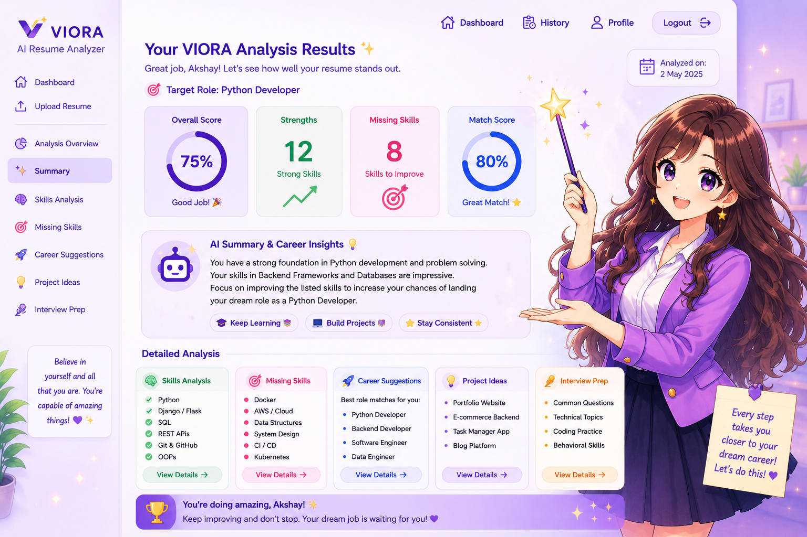

# ✨ VIORA – AI Resume Analyzer

> An AI-powered resume analysis platform designed to help students and job seekers understand and improve their resumes.

## 🚀 Overview

VIORA is an AI-powered Resume Analyzer built using Python and Flask.

It helps users analyze their resumes, identify important skills and strengths, evaluate their resume, and receive personalized suggestions for improvement.

## ✨ Features

- 📄 Resume Upload
- 🤖 AI-Powered Resume Analysis
- 🔍 Skills Identification
- 📊 Resume Evaluation
- 💡 Personalized Improvement Suggestions
- 👤 User Login and Signup
- 📱 Interactive Dashboard
- 🎨 Modern User Interface

## 🛠️ Tech Stack

- Python
- Flask
- HTML5
- CSS3
- JavaScript
- AI

## 📸 Screenshots

### 🏠 Home Page


### 📤 Resume Upload


### 📊 Dashboard


### 🤖 Resume Analysis Results



## 📂 Project Structure

```text
VIORA-AI-Resume-Analyzer/
│
├── app.py
├── requirements.txt
├── .gitignore
│
├── static/
│   └── images/
│
└── templates/
    ├── dashboard.html
    ├── index.html
    ├── login.html
    ├── results.html
    ├── signup.html
    └── upload.html
